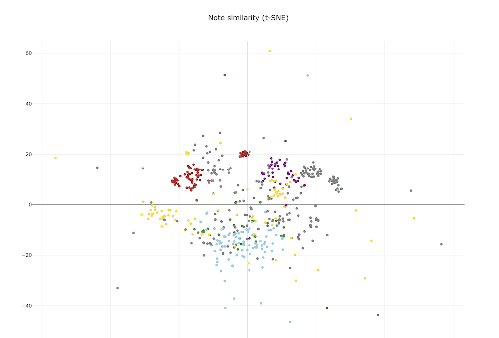

# Embeddings

A CLI tool for exploring [embeddings](https://platform.openai.com/docs/guides/embeddings/what-are-embeddings) of Markdown notes (such as your [Obsidian](https://obsidian.md) vault). Once the embeddings are computed and stored locally for all documents, you can do:

- semantic search using arbitrary queries
- explore related notes of a given note
- plot embeddings in 2D and view the similarity of notes



### Configuration

Create a config file based on `config.init.example` in this repo and place it in:

`~/Library/Application Support/com.oliverfalvai.homecooked.embeddings/config.ini`

You will need an OpenAI API key for computing embeddings (run the `cost` subcommand to estimate your costs before building the embeddings)

### Usage

```
Usage: embeddings <COMMAND>

Commands:
  build    Create or update embeddings for all notes
  cost     Calculate the cost of creating embeddings for all notes
  search   Search relevant notes for a query string
  related  Get related notes to a specific note
  plot     Plot embeddings in 2D and open result in browser
  prune    Prune embeddings of no longer existing notes
  unlinked  Find similar notes that are not linked
  help     Print this message or the help of the given subcommand(s)

Options:
  -h, --help     Print help
  -V, --version  Print version
```

### Inspirations

- https://reasonabledeviations.com/2023/02/05/gpt-for-second-brain/
- Simon Willison's [How to implement Q&A against your documentation with GPT3, embeddings and Datasette](https://simonwillison.net/2023/Jan/13/semantic-search-answers/)
